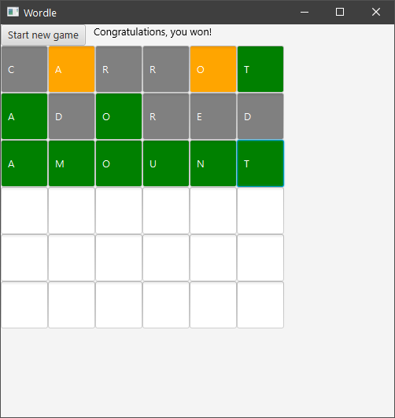

# Wordle
Wordle game with GUI made with Java as a university project in October 2023

Randomizes the word to guess everytime and supports different length words

To run the application, open the command prompt and execute:

```mvn package```

and then:

```java -jar target\wordle-1.0.one-jar.jar```

Note: You need to have Java and Maven installed on your system.



