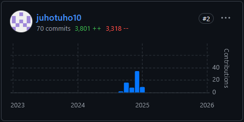

# Mimir
Opensource university data research project that I contributed to a lot during a project course

I do not own the project, this is just here as a link to the original project

To quote the original github readme:
```
    Mimir is an open-source Android app, designed for research purposes at Tampere University (TAU).

    Its main objectives are:

        Centralised sensors measurement logging inside one single app;
        Target both smartphone and smartwatch environments (WearOS 3.5/4.0)

    Both smartphone and smartwatch apps are available on the repository, with a common logging library. 
```
I contributed both to the phone and the smartwatch application and the development  was done with Kotlin and I used Android studio for development  as well as for testing the application using the built in emulator



link to the pull request for the original repository:
https://github.com/agrenier-gnss/mimir/pull/29

link to each one of my commits on the fork of the repository:
https://github.com/DanielBlomberg1/mimir/commits?author=juhotuho10
