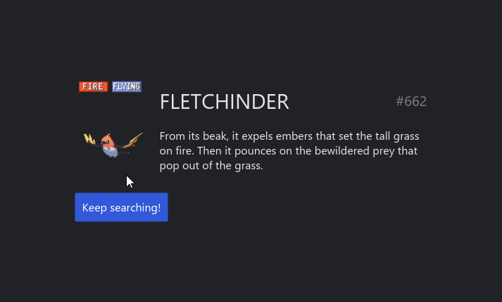

# Pokédex
Pokedex application for loading and displaying random pokemon entries using [PokéAPI](https://pokeapi.co/)

It's an extended version of [Iced Pokedex example](https://github.com/iced-rs/iced/tree/master/examples/pokedex) with gifs, sound and types for the pokemons

I thought the example was pretty cool and I wanted to extend it more to try and understand iced as a UI library and how to handle async Rust 

<div align="center">
  
</div>

🔊 **[video demo with sound](media/pokedex_video_example.mp4)**

If you have Rust installed, you can compile and run the project with:
```
cargo run --release
```