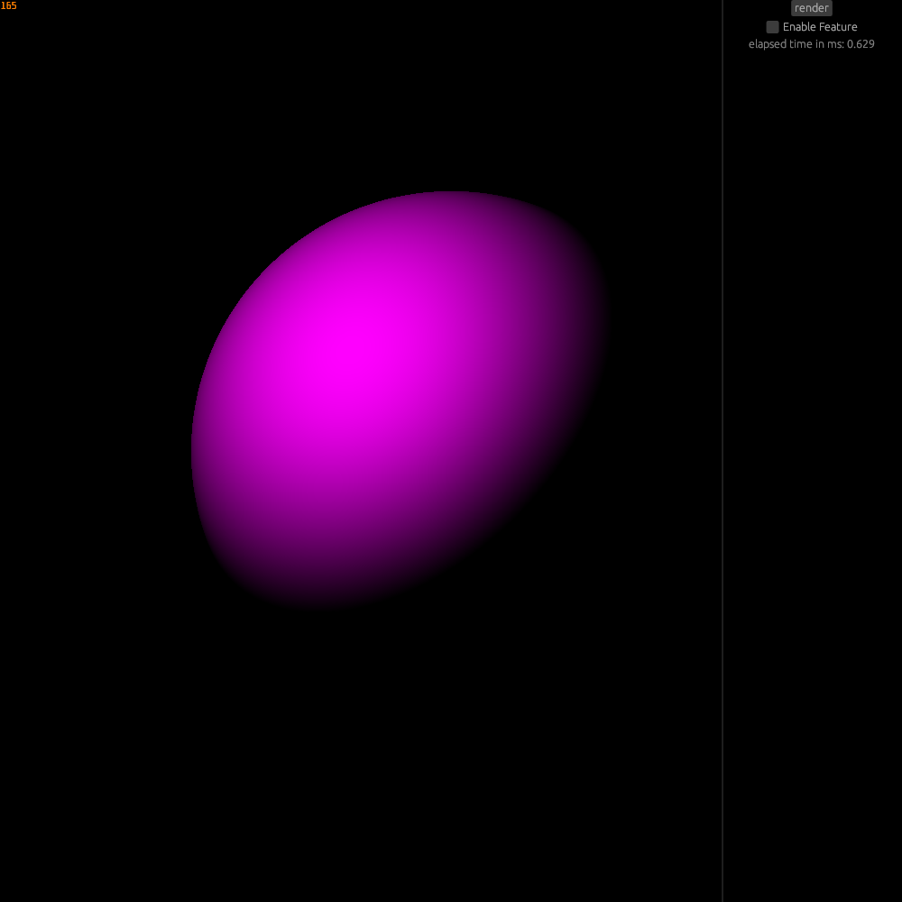

# Rust raytracer
A simple CPU raytracer made in June 2024

This was the starting point before I started to move everything to the much larger GPU taytracer version of this project

Be sure to see the [Fully featured GPU raytracer](https://github.com/juhotuho10/rust_GPU_raytracing)

